# 🏗️ System Patterns

## Architecture Overview
The clinerules system uses a modular directory structure to organize rules and guidelines for Cline to follow when working with projects, incorporating the SPARC methodology for structured development.

## SPARC Workflow Integration
The system integrates the SPARC (Specification, Pseudocode, Architecture, Refinement, Completion) methodology:

```mermaid
flowchart TD
    A[.clinerules/] --> B[Core Rule Files]
    A --> C[Memory Bank Files]
    A --> D[Subdirectories]
    
    B --> B1[💻_01-coding.md]
    B --> B2[📚_02-documentation.md]
    B --> B3[🏃_current-sprint.md]
    B --> B4[📖_README.md]
    
    C --> C1[🧠_memory-bank.md]
    C --> C2[📋_projectbrief.md]
    C --> C3[🔍_productContext.md]
    C --> C4[🔄_activeContext.md]
    C --> C5[🏗️_systemPatterns.md]
    C --> C6[⚙️_techContext.md]
    C --> C7[📊_progress.md]
    
    D --> D1[rules/]
    D --> D2[rules-code/]
    D --> D3[tests/]
    
    D1 --> D1A[🧭_general_guidelines.md]
    D2 --> D2A[👨‍💻_code_guidelines.md]
    D3 --> D3A[🧪_testing_guidelines.md]
    
    E[clinerules-bank/] --> E1[clients/]
    E --> E2[frameworks/]
    E --> E3[project-types/]
    E --> E4[orchestration/]
    E --> E5[docs/]
    E --> E6[manage-rules.sh]
    E --> E7[README.md]
```

## Key Components

### Component 1: Core Rule Files
- **Purpose**: Provide foundational guidelines that apply to all projects
- **Responsibilities**: Define coding standards, documentation requirements, and current sprint focus
- **Interfaces**: Read by Cline directly from the `.clinerules/` directory
- **Implementation Details**: Markdown files with clear sections and bullet points

### Component 2: Memory Bank Files
- **Purpose**: Provide persistent memory between Cline sessions
- **Responsibilities**: Store project context, technical details, and current status
- **Interfaces**: Read by Cline at the start of each session
- **Implementation Details**: Markdown files with emoji prefixes for visual distinction

### Component 3: Subdirectories
- **Purpose**: Organize rules by category
- **Responsibilities**: Separate general guidelines, code-specific rules, and testing guidelines
- **Interfaces**: Files within subdirectories are read by Cline
- **Implementation Details**: Directory structure with descriptive names

### Component 4: Rule Bank
- **Purpose**: Store additional rule sets that can be activated as needed
- **Responsibilities**: Provide context-specific rules for different clients, frameworks, and project types
- **Interfaces**: Files are copied to the `.clinerules/` directory when activated
- **Implementation Details**: Organized directory structure with categorized rule files

### Component 5: Rule Management Script
- **Purpose**: Manage the activation and deactivation of rules
- **Responsibilities**: List available rules, activate/deactivate rules, backup/restore rules
- **Interfaces**: Command-line interface for users
- **Implementation Details**: Bash script with clear commands and feedback

## Design Patterns

### Pattern 1: Modular Organization
- **Usage**: Throughout the system for organizing rules
- **Implementation**: Directory structure with logical categories
- **Benefits**: Easier maintenance, contextual activation, reduced noise

### Pattern 2: Memory Bank
- **Usage**: For persistent context between sessions
- **Implementation**: Emoji-prefixed files with structured content
- **Benefits**: Ensures Cline maintains context across interactions

### Pattern 3: Rule Activation
- **Usage**: For selectively applying rules
- **Implementation**: Copy files from bank to active directory
- **Benefits**: Contextual application of rules, reduced cognitive load

## Data Flow

## Critical Paths

1. **Rule Activation Path**: User → Script → Bank → Active → Cline
   - Critical for ensuring the right rules are applied
   - Potential failure points: file system permissions, emoji handling

2. **Memory Bank Reading Path**: User → Cline → Memory Bank Files
   - Critical for maintaining context between sessions
   - Potential failure points: missing files, incomplete information

## Error Handling Strategy

- File system errors are reported with clear error messages
- Missing files trigger appropriate warnings
- User confirmation is required for destructive operations
- Backup functionality allows for recovery from errors

## Performance Considerations

- Rule files are kept small and focused to minimize processing time
- Directory structure is shallow to reduce traversal time
- Memory bank files use a consistent structure for efficient parsing

## Security Model

- No sensitive information should be stored in rule files
- Script operations are limited to the `.clinerules/` and `clinerules-bank/` directories
- User confirmation is required for potentially destructive operations

## Integration Points

- Cline reads rules from the `.clinerules/` directory
- The management script interacts with both the bank and active directories
- Future integration with Cline UI for visual rule management

## Technical Debt

- Emoji file naming might cause issues in some file systems
- Script error handling could be more robust
- No versioning system for rule files yet
