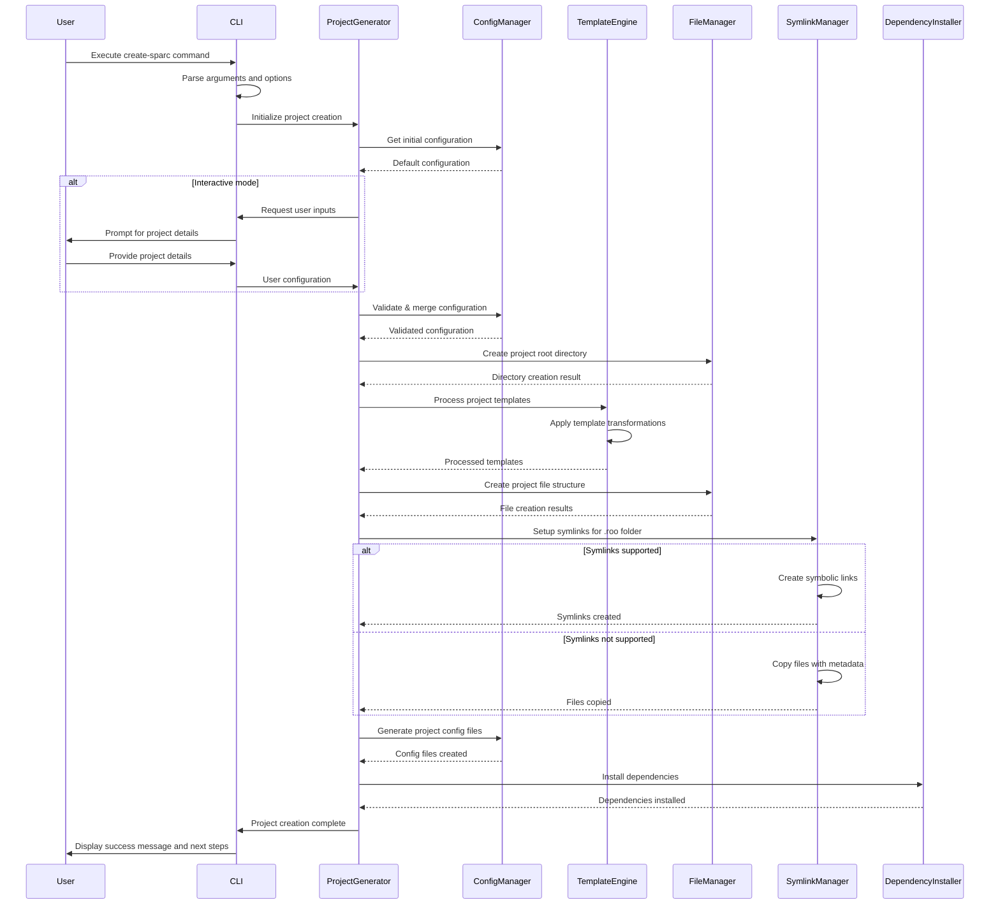

# Create-SPARC NPX Package: Data Flow for Installation Process

## Installation Process Overview

The create-sparc NPX package follows a well-defined data flow during the installation and project creation process. This document outlines the step-by-step flow of data and operations, showing how components interact to create a new SPARC project.

## Sequence Diagram



## Installation Process Detailed Steps

### 1. Command Execution
- **Input**: User executes `npx create-sparc [project-name] [options]`
- **Processing**: CLI parses command line arguments and options
- **Output**: Structured command object with project name and options

### 2. Configuration Collection
- **Input**: Project name and options from CLI
- **Processing**: 
  - Load default configurations
  - If interactive mode is enabled, prompt user for additional details
  - Merge user inputs with defaults and CLI options
- **Output**: Complete project configuration object

### 3. Configuration Validation
- **Input**: Project configuration object
- **Processing**: 
  - Validate against schema
  - Check for conflicting options
  - Normalize paths and names
- **Output**: Validated and normalized configuration

### 4. Project Directory Creation
- **Input**: Project path from configuration
- **Processing**: 
  - Check if directory exists
  - Create directory if needed
  - Verify write permissions
- **Output**: Project root directory ready for files

### 5. Template Processing
- **Input**: 
  - Template files from template repository
  - Project configuration
- **Processing**: 
  - Apply variable substitutions
  - Process conditionals based on configuration
  - Handle includes and template inheritance
- **Output**: Processed template content ready for file creation

### 6. Project Structure Creation
- **Input**: 
  - Processed templates
  - Project configuration
- **Processing**: 
  - Create directory structure
  - Generate files from processed templates
  - Copy static assets
- **Output**: Base project structure on disk

### 7. Symlink Creation
- **Input**: 
  - .roo folder template location
  - .roomodes template location
  - Target locations in project
- **Processing**: 
  - Check symlink support on filesystem
  - Create symbolic links when supported
  - Fall back to copy with metadata when not supported
- **Output**: .roo folder and .roomodes available in project

### 8. Configuration Files Generation
- **Input**: Project configuration
- **Processing**: 
  - Generate package.json
  - Create configuration files (.rooconfig, etc.)
  - Write README with project details
- **Output**: Configuration files written to project

### 9. Dependency Installation
- **Input**: 
  - Package.json with dependencies
  - Project configuration options
- **Processing**: 
  - Install npm dependencies
  - Install dev dependencies
  - Run any post-install scripts
- **Output**: Dependencies installed and ready for use

### 10. Finalization
- **Input**: Installation results from previous steps
- **Processing**: 
  - Verify project integrity
  - Run final setup scripts
  - Generate success message with next steps
- **Output**: Complete project ready for use

## Data Objects

### Project Configuration Object
Central data structure that flows through the system:

```javascript
{
  projectName: "my-sparc-project",
  projectPath: "/path/to/my-sparc-project",
  template: "default",
  installDependencies: true,
  symlink: {
    enabled: true,
    paths: [".roo", ".roomodes"]
  },
  features: {
    typescript: true,
    testing: true,
    cicd: false
  },
  npmClient: "npm", // or "yarn", "pnpm"
  git: {
    init: true,
    initialCommit: true
  }
}
```

### Template Context Object
Used during template processing:

```javascript
{
  project: {
    name: "my-sparc-project",
    safeName: "my_sparc_project", // Safe for variable names
    description: "My SPARC project description"
  },
  features: {
    typescript: true,
    testing: true,
    cicd: false
  },
  author: {
    name: "Developer Name",
    email: "dev@example.com"
  },
  paths: {
    root: "/path/to/my-sparc-project",
    roo: "/path/to/my-sparc-project/.roo",
    roomodes: "/path/to/my-sparc-project/.roomodes"
  }
}
```

## Key Data Flow Considerations

1. **Unidirectional Flow**: Data generally flows from the CLI through the ProjectGenerator to specialized components.

2. **Configuration Centrality**: The project configuration object serves as the central data structure passed between components.

3. **Validation at Boundaries**: Data is validated when crossing component boundaries to ensure integrity.

4. **Error Propagation**: Errors flow back up the component chain with added context at each level.

5. **Progress Reporting**: Status information flows back to the CLI for user feedback.

6. **Symlink Special Handling**: Special data flow for symlink creation with fallback mechanisms.