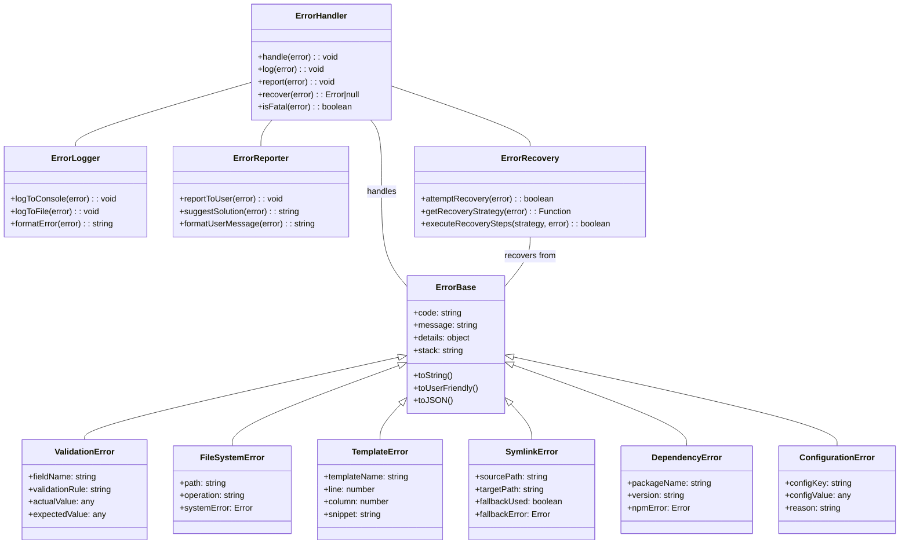

# Create-SPARC NPX Package: Error Handling Architecture

## Error Handling Overview

The create-sparc NPX package implements a robust error handling system designed to gracefully manage failure scenarios, provide helpful feedback to users, and allow for recovery where possible. This document outlines the error handling architecture, error classification, and recovery strategies.

## Error Handling Architecture

## Error Classification & Handling

### 1. ValidationError
- **Description**: Errors related to invalid user inputs or configuration values
- **Examples**:
  - Invalid project name (contains illegal characters)
  - Unsupported configuration options
  - Conflicting settings
- **Handling Strategy**:
  - Clear error message explaining validation failure
  - Suggest valid alternatives or corrections
  - In interactive mode, prompt for corrected input

### 2. FileSystemError
- **Description**: Errors occurring during file system operations
- **Examples**:
  - Permission denied when creating directories/files
  - Path already exists
  - Disk space issues
- **Handling Strategy**:
  - Check permissions before operations
  - Provide clear error message with affected path
  - Suggest solutions (run with higher privileges, free disk space)

### 3. TemplateError
- **Description**: Errors in template processing
- **Examples**:
  - Syntax error in template
  - Missing required template variable
  - Template file not found
- **Handling Strategy**:
  - Show template name and location of error
  - Provide context around the error (line snippet)
  - Log detailed error information for template debugging

### 4. SymlinkError
- **Description**: Errors specific to symbolic link operations
- **Examples**:
  - Symlinks not supported on filesystem
  - Permission denied for symlink creation
  - Target path issues
- **Handling Strategy**:
  - Detect symlink support before attempting creation
  - Automatically fall back to copy method when symlinks not supported
  - Provide clear messaging about fallback mechanism

### 5. DependencyError
- **Description**: Errors during dependency installation
- **Examples**:
  - Network issues during package download
  - Version conflicts
  - Missing peer dependencies
- **Handling Strategy**:
  - Retry with exponential backoff for network issues
  - Provide clear error from npm/yarn with context
  - Suggest manual installation steps as fallback

### 6. ConfigurationError
- **Description**: Errors in configuration processing
- **Examples**:
  - Invalid configuration schema
  - Missing required configuration
  - Configuration file corruption
- **Handling Strategy**:
  - Validate configuration early in the process
  - Provide clear error message with configuration key
  - Suggest valid configuration values or corrections

## Error Handling Components

### ErrorHandler
- **Purpose**: Central error handling coordination
- **Responsibilities**:
  - Receive errors from all components
  - Classify and route errors appropriately
  - Determine if error is fatal or can be recovered
  - Orchestrate logging, reporting, and recovery

### ErrorLogger
- **Purpose**: Handle error logging to various outputs
- **Responsibilities**:
  - Format error details for logging
  - Log to console with appropriate level
  - Log to file with extended information
  - Handle log rotation and management

### ErrorReporter
- **Purpose**: Format and present errors to users
- **Responsibilities**:
  - Convert technical errors to user-friendly messages
  - Provide suggestions for error resolution
  - Format error output (color, indentation, etc.)
  - Include relevant command references

### ErrorRecovery
- **Purpose**: Attempt to recover from non-fatal errors
- **Responsibilities**:
  - Identify recovery strategies for error types
  - Execute recovery steps
  - Report recovery success or failure
  - Maintain system integrity during recovery

## Error Flow Process

1. **Detection**: Error occurs in a component
2. **Capture**: Component wraps native error in appropriate ErrorBase subclass
3. **Propagation**: Error is passed to the ErrorHandler
4. **Logging**: Error details are logged for debugging
5. **Recovery Attempt**: For non-fatal errors, recovery is attempted
6. **User Reporting**: User-friendly error message is displayed
7. **Continuation or Termination**: Process continues if error is non-fatal and recovered, or terminates gracefully

## Recovery Strategies

### For ValidationError
- Attempt to sanitize or normalize invalid values
- Fall back to default values where safe
- Prompt for corrected input in interactive mode

### For FileSystemError
- Retry operation with delay (for timing/locking issues)
- Attempt operation with different permissions
- Create parent directories if missing

### For TemplateError
- Skip problematic template section if non-critical
- Use default template as fallback
- Attempt with different template variable resolution

### For SymlinkError
- Automatically fall back to copy method
- Record symlink relationships in metadata file
- Provide utilities for future symlink creation

### For DependencyError
- Retry installation with different npm/yarn commands
- Skip optional dependencies
- Continue with warning about missing dependencies

### For ConfigurationError
- Fall back to default configuration
- Partial configuration application (valid parts only)
- Create minimal viable configuration

## Error Diagnostics and Reporting

### Verbose Mode
- Activated with `--verbose` flag
- Provides detailed technical error information
- Shows stack traces and internal error details
- Logs additional context information

### Error Codes
- Each error type has a unique code prefix:
  - VAL: Validation errors
  - FS: File system errors
  - TPL: Template errors
  - SYM: Symlink errors
  - DEP: Dependency errors
  - CFG: Configuration errors
- Error codes are documented for user reference

### Error Telemetry (Optional, Privacy-Preserving)
- With user permission, anonymized error reports can be collected
- Helps improve error handling and fix common issues
- No personal or project information is included
- Can be disabled with `--no-error-reporting` flag

## Key Error Handling Principles

1. **User-Friendly**: Error messages are clear, concise, and actionable
2. **Robust**: The system can handle unexpected errors gracefully
3. **Recoverable**: Where possible, errors are automatically recovered from
4. **Informative**: Errors provide enough context to understand and fix the issue
5. **Debuggable**: Detailed information is available for troubleshooting
6. **Fail Fast**: Errors are detected early to prevent cascading issues