# Create-SPARC NPX Package: Extension Points for Future Features

## Extension Architecture Overview

The create-sparc NPX package is designed with extensibility in mind, allowing for future enhancements and customizations without requiring changes to the core codebase. This document outlines the key extension points and potential future features that could be implemented through these extension mechanisms.

## Extension Points Diagram

```mermaid
graph TD
    Core[Core System] --- EP1[Plugin System]
    Core --- EP2[Custom Templates]
    Core --- EP3[Command Extensions]
    Core --- EP4[Configuration Extensions]
    Core --- EP5[Hook System]
    
    EP1 --- F1[Custom Generators]
    EP1 --- F2[Integration Plugins]
    EP1 --- F3[Reporting Plugins]
    
    EP2 --- F4[Project Type Templates]
    EP2 --- F5[Custom Mode Templates]
    EP2 --- F6[Component Templates]
    
    EP3 --- F7[Custom Commands]
    EP3 --- F8[Command Overrides]
    
    EP4 --- F9[Configuration Presets]
    EP4 --- F10[External Configuration]
    
    EP5 --- F11[Lifecycle Hooks]
    EP5 --- F12[Validation Hooks]
    
    style Core fill:#f9f,stroke:#333,stroke-width:2px
    style EP1 fill:#bbf,stroke:#333,stroke-width:1px
    style EP2 fill:#bbf,stroke:#333,stroke-width:1px
    style EP3 fill:#bbf,stroke:#333,stroke-width:1px
    style EP4 fill:#bbf,stroke:#333,stroke-width:1px
    style EP5 fill:#bbf,stroke:#333,stroke-width:1px
```

## Detailed Extension Points

### 1. Plugin System

The Plugin System provides a mechanism for third-party developers to extend the functionality of create-sparc without modifying the core codebase.

#### Implementation Strategy
- Plugin Registry: Central registry to manage and load plugins
- Plugin Interface: Well-defined interfaces for different plugin types
- Plugin Discovery: Automatic discovery of installed plugins

#### Extension Capabilities
- Custom Generators: Add new project generation strategies
- Integration Plugins: Connect with external services and tools
- Preprocessing Plugins: Modify templates before processing
- Postprocessing Plugins: Process generated files after creation

#### Future Features
- **IDE Integration Plugins**: Generate IDE-specific configuration files
- **Cloud Service Setup**: Integrate with popular cloud services
- **CI/CD Pipeline Configuration**: Generate CI/CD configurations for different platforms
- **Framework-specific Plugins**: Add support for specific frontend/backend frameworks

### 2. Custom Templates

The Template System allows for custom templates that define project structures, files, and configurations.

#### Implementation Strategy
- Template Registry: Manage available templates
- Template Discovery: Locate templates from multiple sources
- Template Inheritance: Allow templates to extend other templates
- Template Variables: Support for dynamic content in templates

#### Extension Capabilities
- Project Type Templates: Define complete project structures
- Component Templates: Define reusable components
- Custom Mode Templates: Define templates for specific SPARC modes
- Partial Templates: Reusable template fragments

#### Future Features
- **Template Marketplace**: Community-contributed templates
- **Template Versioning**: Support for versioned templates
- **Interactive Template Selection**: UI for browsing and selecting templates
- **Template Preview**: Preview generated structure before creation

### 3. Command Extensions

The Command System allows for extending the CLI with new commands or overriding existing ones.

#### Implementation Strategy
- Command Registry: Central registry of available commands
- Command Loader: Dynamic loading of command modules
- Command API: Consistent interface for all commands

#### Extension Capabilities
- Custom Commands: Add new commands to the CLI
- Command Overrides: Override behavior of existing commands
- Command Middleware: Add preprocessing/postprocessing to commands
- Command Groups: Organize related commands

#### Future Features
- **Project Analysis Commands**: Analyze existing projects
- **Migration Commands**: Migrate between template versions
- **Project Health Checks**: Validate project against best practices
- **Interactive Mode Extensions**: Enhanced interactive command options

### 4. Configuration Extensions

The Configuration System supports extension through custom configuration providers and presets.

#### Implementation Strategy
- Configuration Schema: Extensible schema definition
- Configuration Providers: Pluggable sources of configuration
- Configuration Presets: Predefined configuration combinations

#### Extension Capabilities
- Configuration Presets: Predefined configuration settings
- External Configuration Sources: Load from external services
- Configuration Validators: Custom validation rules
- Configuration Transformers: Transform between formats

#### Future Features
- **Team Configuration Presets**: Shared team configuration standards
- **Configuration UI**: Visual editor for configuration
- **Configuration Profiles**: Context-specific configurations
- **Remote Configuration**: Fetch configurations from repositories

### 5. Hook System

The Hook System provides lifecycle hooks for various stages of the project creation process.

#### Implementation Strategy
- Hook Registry: Central registry of available hooks
- Hook Points: Well-defined points in the process
- Hook Priority: Ordering mechanism for multiple hooks

#### Extension Capabilities
- Lifecycle Hooks: Execute at specific points in process
- Validation Hooks: Add custom validation logic
- Transformation Hooks: Transform data or files
- Error Handling Hooks: Custom error processing

#### Future Features
- **Post-Creation Hooks**: Actions after project creation
- **Integration Testing Hooks**: Automatically test generated project
- **Documentation Generation Hooks**: Generate additional documentation
- **Dependency Analysis Hooks**: Verify and update dependencies

## Specific Future Feature Extensions

### 1. Multi-Project Workspace Support
- **Extension Point**: Project Generator
- **Implementation**: Extend the project generator to support creating multiple projects within a workspace

### 2. Custom SPARC Mode Creation
- **Extension Point**: Template System
- **Implementation**: Templates for defining new SPARC modes with custom rules and behaviors

### 3. Enhanced Symlink Management
- **Extension Point**: File Manager
- **Implementation**: Advanced symlink tracking, repair tools, and synchronization utilities

### 4. Integrated Test Generation
- **Extension Point**: Plugin System
- **Implementation**: Plugins to generate test suites based on created project structure

### 5. Project Visualization Tools
- **Extension Point**: Command Extensions
- **Implementation**: Commands to generate visual representations of project architecture

### 6. Environment Configuration Management
- **Extension Point**: Configuration Extensions
- **Implementation**: Manage different environment configurations securely

### 7. Cloud Deployment Integration
- **Extension Point**: Hook System
- **Implementation**: Post-creation hooks to set up cloud deployment pipelines

### 8. Internationalization Support
- **Extension Point**: Template System
- **Implementation**: Multi-language templates and localization infrastructure

### 9. Performance Profiling Tools
- **Extension Point**: Plugin System
- **Implementation**: Plugins to analyze and optimize generated projects

### 10. Security Scanning Integration
- **Extension Point**: Hook System
- **Implementation**: Security validation hooks to scan generated code

## Extension Development Guide

To facilitate third-party extensions, the create-sparc package will include:

1. **Extension Development Documentation**:
   - Detailed API references
   - Extension patterns and best practices
   - Example extensions for different types

2. **Extension Scaffolding Tools**:
   - Templates for creating new extensions
   - Testing utilities for extensions
   - Extension packaging guidelines

3. **Extension Registry**:
   - Mechanism for discovering community extensions
   - Version compatibility information
   - Installation and usage instructions

## Extension Versioning and Compatibility

To ensure long-term stability for extensions:

1. **Semantic Versioning**: All extension APIs follow semantic versioning
2. **Compatibility Matrix**: Clear documentation of API compatibility across versions
3. **Deprecation Policy**: Gradual deprecation with clear migration paths
4. **Extension Verification**: Testing utilities to verify compatibility

## Extension Governance

1. **Extension Guidelines**: Standards for community extensions
2. **Review Process**: Optional review for official extensions
3. **Security Considerations**: Guidelines for secure extension development
4. **Performance Standards**: Benchmarks for extension performance