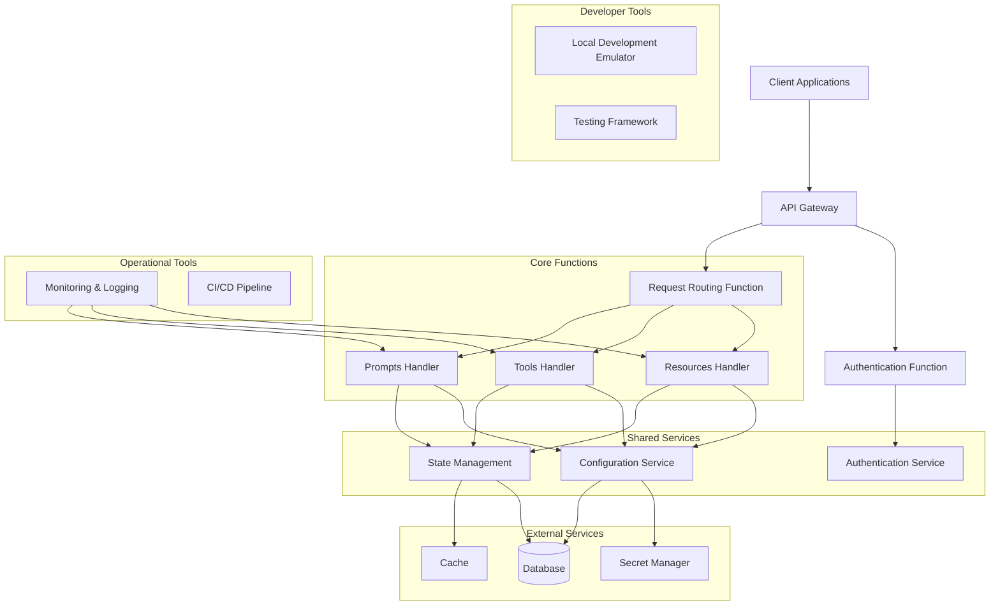
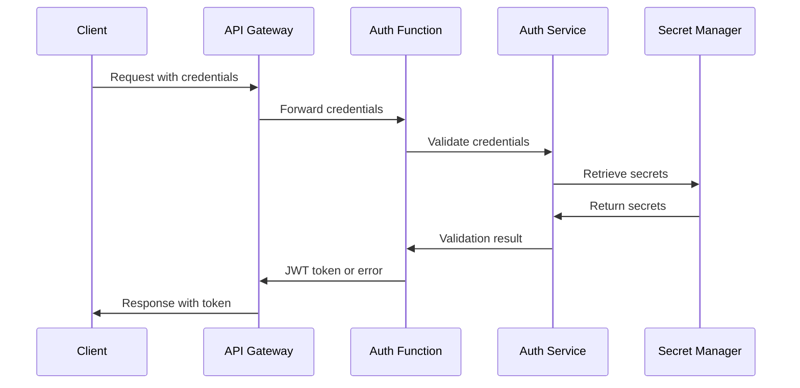
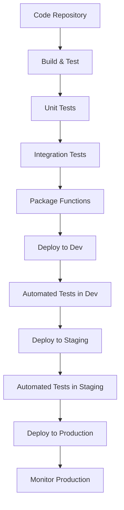

# Logitech MCP Serverless Architecture

## 1. Executive Summary

This document defines the serverless architecture for the Logitech MCP server, transforming it from a traditional HTTP server to a cloud-native, serverless implementation. The architecture enables horizontal scaling, reduces operational costs, and improves deployment flexibility while maintaining all existing functionality.

## 2. Architecture Overview

### 2.1 Architectural Approach

The Logitech MCP server will be refactored to follow a serverless-first design pattern with these key characteristics:
- **Stateless Functions**: Core business logic encapsulated in stateless functions
- **API Gateway Integration**: HTTP requests handled through cloud provider API gateways
- **Event-Driven Design**: Functions triggered by various event sources (HTTP, time-based)
- **Cloud-Native Storage**: External persistence for any state requirements
- **Provider Agnostic**: Core logic independent of specific cloud provider implementations

### 2.2 Component Diagram



## 3. Service Boundaries and Interfaces

### 3.1 Function Definitions

| Function | Responsibility | Trigger | Input | Output |
|----------|----------------|---------|-------|--------|
| **Authentication Function** | Validate requests & generate tokens | HTTP Request | Authentication headers | JWT token or error |
| **Request Routing Function** | Route requests to appropriate handlers | HTTP Request | HTTP request object | Routed to correct handler |
| **Resources Handler** | Process resource requests | Routed HTTP Request | Resource URI & parameters | Resource response |
| **Tools Handler** | Execute tool operations | Routed HTTP Request | Tool name & parameters | Tool execution result |
| **Prompts Handler** | Load and return prompts | Routed HTTP Request | Prompt name & parameters | Formatted prompt |
| **Warm-Up Function** | Keep functions warm | Scheduled Event | Timer event | Success or error |

### 3.2 Interface Contracts

#### 3.2.1 HTTP Endpoints

The API Gateway will expose the following endpoints:

| Endpoint | Method | Description | Required Headers |
|----------|--------|-------------|-----------------|
| `/auth` | POST | Authenticate and obtain token | `Basic Auth` |
| `/resources/{resourceId}` | GET | Retrieve a resource | `Authorization` |
| `/tools/{toolName}` | POST | Execute a tool | `Authorization` |
| `/prompts/{promptName}` | POST | Load a prompt | `Authorization` |
| `/health` | GET | Check service health | None |

#### 3.2.2 Event Payloads

**Resource Request Example:**
```json
{
  "resourceUri": "example://123",
  "parameters": {
    "id": "123"
  }
}
```

**Tool Request Example:**
```json
{
  "name": "hello_world",
  "parameters": {
    "name": "John"
  }
}
```

**Prompt Request Example:**
```json
{
  "name": "greeting",
  "parameters": {
    "name": "John"
  }
}
```

### 3.3 Cross-Service Communication

Services will communicate through:
1. **Direct Function Invocation**: For synchronous operations
2. **Message Queue**: For asynchronous operations
3. **Shared Database**: For persistent state
4. **Distributed Cache**: For ephemeral state

## 4. Resource Requirements and Scaling

### 4.1 Function Configuration

| Function | Memory | Timeout | Concurrency | Cold Start Optimization |
|----------|--------|---------|-------------|--------------------------|
| Authentication | 256MB | 5s | High | Provisioned Concurrency |
| Request Routing | 256MB | 5s | High | Provisioned Concurrency |
| Resources Handler | 512MB | 15s | Medium | Warm-up Events |
| Tools Handler | 1GB | 30s | Medium | Warm-up Events |
| Prompts Handler | 512MB | 15s | Medium | Warm-up Events |
| Warm-Up | 128MB | 10s | Low | N/A |

### 4.2 Scaling Considerations

**Auto-scaling Policy:**
- Scale based on concurrent requests with 60% target utilization
- Maximum concurrency varies by function (see table above)
- Implement throttling to prevent service abuse

**Scaling Limitations:**
- Database connection limits must be respected
- Rate limits for external API dependencies must be handled
- Cold start latency will impact sudden traffic spikes

### 4.3 Cost Optimization

- Use provisioned concurrency only for critical paths
- Configure auto-scaling to scale down quickly in periods of low usage
- Implement tiered storage strategy with TTL for infrequently accessed data
- Monitor cold start frequencies and optimize deployment packages

## 5. Security Model

### 5.1 Authentication & Authorization

**Authentication Flow:**


**Authorization Model:**
- JWT tokens with short expiration times (15 minutes)
- Role-based access control for different API operations
- Resource-level permissions based on client identity

### 5.2 Data Protection

- All data encrypted in transit using TLS 1.2+
- Sensitive data encrypted at rest using cloud provider encryption services
- API keys, secrets, and credentials stored in cloud provider secret management services
- No sensitive data in environment variables or function code

### 5.3 Network Security

- API Gateway configured with WAF protection
- VPC integration for enhanced network isolation when accessing databases
- IP-based rate limiting to prevent abuse
- CORS configuration to limit cross-origin requests

### 5.4 Compliance Considerations

- Audit logging for all sensitive operations
- Configurable data retention policies
- Geographic data residency capabilities
- Compliance with relevant regulations (GDPR, CCPA) through data handling practices

## 6. State Management

### 6.1 Stateless Design Principles

The architecture follows these stateless design principles:
1. No local state between function invocations
2. All persistent state stored in external services
3. Each request contains all information needed for processing
4. Idempotent operations to handle retry scenarios

### 6.2 State Storage Options

| State Type | Storage Solution | Characteristics | Use Cases |
|------------|------------------|----------------|-----------|
| **Session State** | Distributed Cache | Short TTL, high availability | User sessions, temporary tokens |
| **Application State** | Document Database | Structured, queryable | Configuration, user preferences |
| **Transactional Data** | Relational Database | ACID compliant | Financial operations, critical data |
| **Audit Trail** | Append-only Log | Immutable, time-series | Security logs, compliance |

### 6.3 Caching Strategy

**Multi-level Caching:**
1. **Edge Cache**: API Gateway responses cached at CDN level
2. **Application Cache**: Function-level cache for frequent computations
3. **Data Cache**: Database query results cached in distributed cache

**Cache Invalidation:**
- Time-based expiration for all cached resources
- Event-driven invalidation for critical updates
- Versioned cache keys for configuration changes

### 6.4 Distributed Transactions

For operations requiring consistency across multiple services:
1. Implement saga pattern for complex workflows
2. Use DynamoDB transactions or similar for atomic operations
3. Apply compensating transactions for rollback scenarios
4. Maintain event logs for auditability and troubleshooting

## 7. Observability and Monitoring

### 7.1 Logging Strategy

- Structured logging with consistent format across all functions
- Correlation IDs propagated through all service calls
- Log levels adjusted based on environment (verbose in dev, errors only in prod)
- Log aggregation in cloud provider's logging service

### 7.2 Metrics and Monitoring

**Key Metrics:**
- Invocation count and duration for all functions
- Error rates and types
- Cold start frequency and duration
- Database connection utilization
- Cache hit/miss rates

**Alerting Thresholds:**
- Error rate > 1% over 5-minute period
- p95 latency > 1000ms for any endpoint
- Function timeout rate > 0.1%

### 7.3 Distributed Tracing

- Implement OpenTelemetry for consistent tracing
- Capture end-to-end request flows across all services
- Sample traces at 5% in production, 100% in other environments
- Analyze trace data for performance optimization

## 8. Deployment Strategy

### 8.1 Infrastructure as Code

All infrastructure components will be defined using:
- AWS: CloudFormation or AWS CDK
- Azure: ARM Templates or Bicep
- GCP: Terraform or Deployment Manager

The IaC templates will include:
- Function definitions and configurations
- API Gateway routes and methods
- Database resources
- Security policies and IAM roles
- Monitoring and alerting setup

### 8.2 CI/CD Pipeline



### 8.3 Multi-Environment Strategy

| Environment | Purpose | Configuration | Deployment Frequency |
|-------------|---------|--------------|---------------------|
| Development | Active development | Minimal resources, debug logging | On commit |
| Testing | Automated tests | Mirror of production, isolated | On PR approval |
| Staging | Pre-production validation | Production-like | After testing success |
| Production | Live system | Full resources, optimized | After staging validation |

## 9. Cloud Provider Implementation Details

### 9.1 AWS Implementation

- **Compute**: AWS Lambda functions
- **API Management**: Amazon API Gateway
- **Authentication**: Amazon Cognito + Lambda authorizers
- **Database**: DynamoDB for document storage, Aurora Serverless for relational
- **Cache**: ElastiCache or DAX
- **Secrets**: AWS Secrets Manager
- **Monitoring**: CloudWatch Logs, Metrics, and X-Ray

### 9.2 Azure Implementation

- **Compute**: Azure Functions
- **API Management**: Azure API Management
- **Authentication**: Azure Active Directory B2C
- **Database**: Cosmos DB for document storage, Azure SQL Serverless for relational
- **Cache**: Azure Cache for Redis
- **Secrets**: Azure Key Vault
- **Monitoring**: Azure Monitor and Application Insights

### 9.3 GCP Implementation

- **Compute**: Google Cloud Functions
- **API Management**: API Gateway
- **Authentication**: Firebase Authentication
- **Database**: Firestore for document storage, Cloud Spanner for relational
- **Cache**: Memorystore
- **Secrets**: Secret Manager
- **Monitoring**: Cloud Monitoring and Cloud Trace

## 10. Migration Strategy

### 10.1 Phased Migration Approach

The migration will follow this phased approach:

1. **Phase 1: Infrastructure Setup**
   - Set up serverless infrastructure
   - Configure CI/CD pipelines
   - Establish monitoring and logging

2. **Phase 2: Core Refactoring**
   - Refactor HTTP server to function handlers
   - Implement stateless operation
   - Configure database connections

3. **Phase 3: Optimization**
   - Implement cold start optimizations
   - Configure environment variables
   - Fine-tune performance

4. **Phase 4: Testing and Deployment**
   - Execute comprehensive tests
   - Deploy to production with phased rollout

### 10.2 Rollback Strategy

If issues occur during migration:
1. Use feature flags to disable serverless paths
2. Maintain dual deployment capability during transition
3. Implement automated health checks for quick issue detection
4. Prepare database reversion scripts if needed

## 11. Conclusion

The serverless architecture for the Logitech MCP server provides a scalable, cost-effective solution that maintains all current functionality while adding cloud-native capabilities. By following the design principles and implementation approach outlined in this document, the migration will achieve the specified success criteria:

1. All MCP functionality preserved in serverless environment
2. Cold start times under 500ms for 95% of invocations
3. Zero function timeouts during normal operation
4. 30%+ cost reduction compared to traditional hosting
5. Successful deployment across multiple cloud providers

This architecture positions the Logitech MCP server for future growth, with improved scalability, maintainability, and operational efficiency.