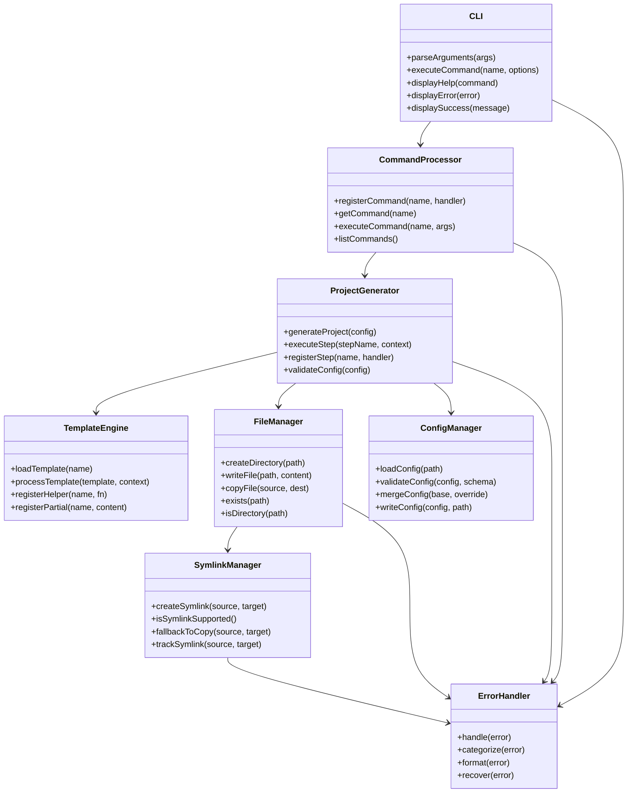
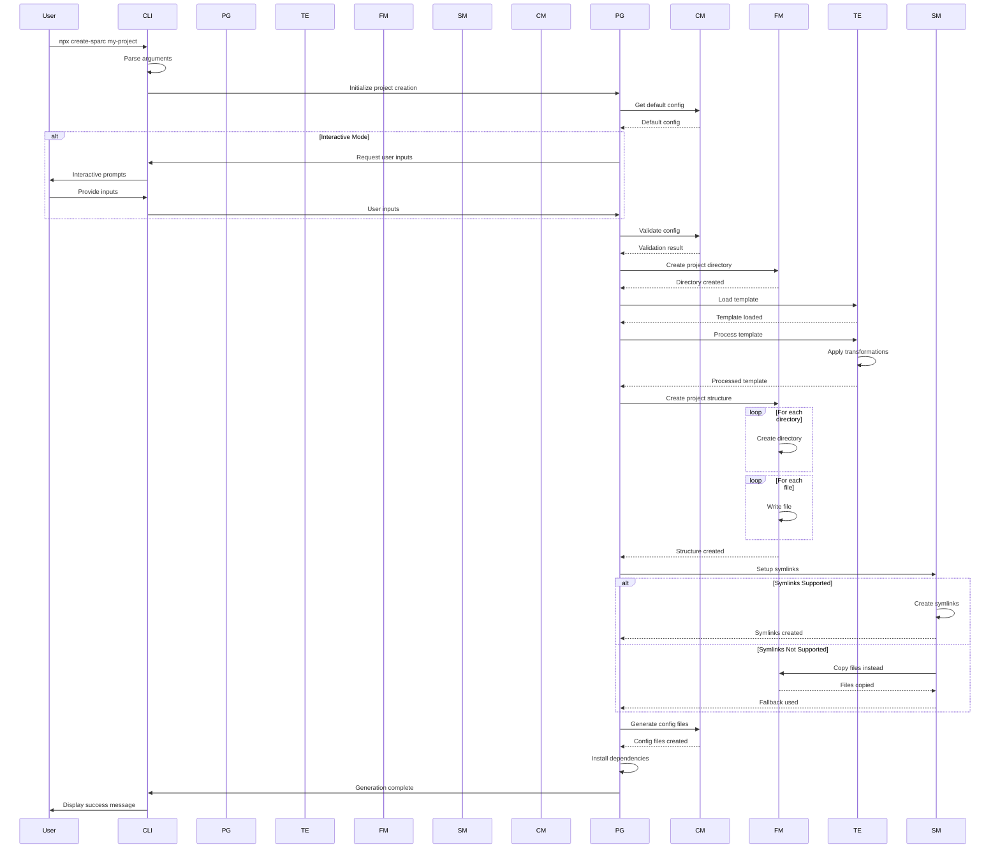
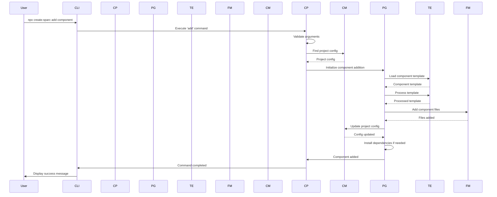

# Create-SPARC NPX Package: Architecture Phase

## Overview

The Architecture phase defines the detailed system structure, component interfaces, and data flows for the create-sparc NPX package. This document builds upon the high-level system design and pseudocode to provide a comprehensive blueprint for implementation.

## Architecture Principles

1. **Modularity**: Components are designed with single responsibilities and clear interfaces
2. **Extensibility**: All major subsystems support extension through plugins or hooks
3. **Robustness**: Error handling is integrated at all levels with recovery mechanisms
4. **Performance**: System design optimizes for speed and minimal resource usage
5. **Maintainability**: Code organization follows clear patterns for long-term maintenance

## Core Architecture

### Component Structure



## Component Details

### 1. CLI (Command Line Interface)

The CLI component provides the user interface for the create-sparc package.

#### Responsibilities
- Parse command line arguments and options
- Route commands to appropriate handlers
- Display output (success, errors, help)
- Handle user interaction (prompts, confirmations)

#### Key Interfaces

```typescript
interface CLIOptions {
  verbose?: boolean;
  help?: boolean;
  version?: boolean;
  [key: string]: any;
}

interface CommandDefinition {
  name: string;
  description: string;
  usage: string;
  options: Array<{
    name: string;
    alias?: string;
    description: string;
    type: 'string' | 'boolean' | 'number';
    default?: any;
    required?: boolean;
  }>;
  action: (args: string[], options: CLIOptions) => Promise<void>;
}
```

#### Implementation Notes
- Uses a command registry pattern
- Implements colorized output for better readability
- Supports interactive prompts when needed
- Provides progress indicators for long-running operations

### 2. Command Processor

The Command Processor manages the registration and execution of commands.

#### Responsibilities
- Register command handlers
- Parse command-specific options
- Execute commands with proper context
- Validate command inputs

#### Key Interfaces

```typescript
interface CommandHandler {
  execute(args: string[], options: CLIOptions): Promise<void>;
  validateArgs(args: string[]): boolean;
  generateHelp(): string;
}

interface CommandRegistry {
  register(name: string, handler: CommandHandler): void;
  get(name: string): CommandHandler | undefined;
  list(): string[];
  executeCommand(name: string, args: string[], options: CLIOptions): Promise<void>;
}
```

#### Implementation Notes
- Uses factory pattern for creating command handlers
- Supports middleware for pre/post command processing
- Implements command aliases for convenience

### 3. Project Generator

The Project Generator orchestrates the project creation process.

#### Responsibilities
- Coordinate generation steps
- Manage generation context
- Validate generation configuration
- Handle the generation lifecycle

#### Key Interfaces

```typescript
interface GenerationStep {
  name: string;
  execute(context: GenerationContext): Promise<void>;
  validate(context: GenerationContext): Promise<boolean>;
  rollback?(context: GenerationContext): Promise<void>;
}

interface GenerationContext {
  config: ProjectConfig;
  templateResult?: TemplateResult;
  targetDirectory: string;
  errors: Error[];
  addError(error: Error): void;
  setResult(key: string, value: any): void;
  getResult(key: string): any;
}

interface ProjectGenerator {
  registerStep(step: GenerationStep): void;
  executeStep(stepName: string, context: GenerationContext): Promise<void>;
  generateProject(config: ProjectConfig): Promise<GenerationResult>;
}
```

#### Implementation Notes
- Implements chain of responsibility pattern for steps
- Provides transaction-like behavior with rollback capabilities
- Supports parallel execution of independent steps

### 4. Template Engine

The Template Engine processes templates with dynamic content.

#### Responsibilities
- Load templates from sources
- Process template variables
- Handle template inheritance and composition
- Support conditional sections and loops

#### Key Interfaces

```typescript
interface Template {
  name: string;
  files: TemplateFile[];
  directories: TemplateDirectory[];
  dependencies: {
    production: Record<string, string>;
    development: Record<string, string>;
  };
}

interface TemplateFile {
  path: string;
  content: string;
  executable?: boolean;
  condition?: string;
}

interface TemplateDirectory {
  path: string;
  condition?: string;
}

interface TemplateEngine {
  loadTemplate(name: string): Promise<Template>;
  processTemplate(template: Template, context: object): Promise<TemplateResult>;
  registerHelper(name: string, fn: Function): void;
  registerPartial(name: string, content: string): void;
}
```

#### Implementation Notes
- Uses handlebars or similar templating library
- Supports template caching for performance
- Implements template discovery from multiple sources
- Provides template validation before processing

### 5. File Manager

The File Manager handles all file system operations.

#### Responsibilities
- Create directories and files
- Copy and move files
- Check file existence and type
- Handle file system errors

#### Key Interfaces

```typescript
interface FileOperationOptions {
  overwrite?: boolean;
  mode?: number;
  encoding?: string;
}

interface FileManager {
  createDirectory(path: string, options?: FileOperationOptions): Promise<void>;
  writeFile(path: string, content: string, options?: FileOperationOptions): Promise<void>;
  copyFile(source: string, destination: string, options?: FileOperationOptions): Promise<void>;
  exists(path: string): Promise<boolean>;
  isDirectory(path: string): Promise<boolean>;
  isFile(path: string): Promise<boolean>;
}
```

#### Implementation Notes
- Handles platform-specific path issues
- Implements recursive directory creation
- Provides atomic file operations where possible
- Supports file operation batching for performance

### 6. Symlink Manager

The Symlink Manager specializes in symbolic link operations.

#### Responsibilities
- Create symbolic links
- Check symlink support
- Provide fallback mechanisms
- Track symlink relationships

#### Key Interfaces

```typescript
interface SymlinkOptions {
  type?: 'file' | 'directory';
  force?: boolean;
}

interface SymlinkRecord {
  source: string;
  target: string;
  timestamp: number;
  fallbackUsed: boolean;
}

interface SymlinkManager {
  createSymlink(source: string, target: string, options?: SymlinkOptions): Promise<void>;
  isSymlinkSupported(): Promise<boolean>;
  fallbackToCopy(source: string, target: string, options?: FileOperationOptions): Promise<void>;
  trackSymlink(source: string, target: string, fallbackUsed: boolean): void;
  getSymlinkRecords(): SymlinkRecord[];
}
```

#### Implementation Notes
- Handles Windows symlink restrictions
- Implements metadata for tracking symlink intent
- Provides repair utilities for broken symlinks
- Supports relative or absolute symlink paths

### 7. Configuration Manager

The Configuration Manager handles project configurations.

#### Responsibilities
- Load and validate configurations
- Merge configuration objects
- Handle defaults and overrides
- Generate configuration files

#### Key Interfaces

```typescript
interface ConfigSchema {
  properties: Record<string, {
    type: string;
    description?: string;
    default?: any;
    required?: boolean;
    enum?: any[];
  }>;
  required: string[];
}

interface ValidationResult {
  valid: boolean;
  errors: Array<{
    property: string;
    message: string;
    value: any;
  }>;
}

interface ConfigManager {
  loadConfig(path: string): Promise<any>;
  validateConfig(config: any, schema: ConfigSchema): ValidationResult;
  mergeConfig(base: any, override: any): any;
  writeConfig(config: any, path: string): Promise<void>;
  getDefaultConfig(): any;
}
```

#### Implementation Notes
- Uses JSON Schema for validation
- Implements deep merging with proper array handling
- Supports environment variable substitution
- Provides configuration migration utilities

### 8. Error Handler

The Error Handler provides centralized error management.

#### Responsibilities
- Categorize and format errors
- Log error details
- Provide recovery strategies
- Generate user-friendly messages

#### Key Interfaces

```typescript
interface ErrorCategory {
  name: string;
  recoverable: boolean;
  userMessage: string;
}

interface RecoveryStrategy {
  canRecover(error: Error): boolean;
  recover(error: Error): Promise<boolean>;
}

interface ErrorHandler {
  handle(error: Error): void;
  categorize(error: Error): ErrorCategory;
  format(error: Error, verbose: boolean): string;
  recover(error: Error): Promise<boolean>;
  registerRecoveryStrategy(strategy: RecoveryStrategy): void;
}
```

#### Implementation Notes
- Implements chain of responsibility for error handling
- Provides detailed logging for debugging
- Supports internationalization of error messages
- Implements structured error reporting

## Data Flows

### Project Creation Flow



### Component Addition Flow



## Interface Definitions

### Command Line Interface

```
$ npx create-sparc [command] [options]

Commands:
  init [name]       Create a new SPARC project
  add [component]   Add a component to an existing project
  help [command]    Display help for a specific command

Global Options:
  --version         Show version number                             [boolean]
  --help            Show help                                       [boolean]
  --verbose         Enable verbose output                           [boolean]

Init Command Options:
  --template        Template to use                 [string] [default: "default"]
  --skip-install    Skip dependency installation                    [boolean]
  --use-npm         Use npm as package manager                      [boolean]
  --use-yarn        Use yarn as package manager                     [boolean]
  --use-pnpm        Use pnpm as package manager                     [boolean]
  --no-git          Skip git initialization                         [boolean]
  --typescript      Use TypeScript                                  [boolean]
  --no-symlink      Disable symlink creation                        [boolean]

Add Command Options:
  --name            Component name                                  [required]
  --type            Component type              [string] [default: "component"]
  --path            Custom path for component                        [string]
```

### Configuration Schema

```json
{
  "type": "object",
  "properties": {
    "projectName": {
      "type": "string",
      "description": "Name of the project",
      "pattern": "^[a-zA-Z0-9-_]+$"
    },
    "projectPath": {
      "type": "string",
      "description": "Path to the project directory"
    },
    "template": {
      "type": "string",
      "description": "Template to use for project generation",
      "default": "default"
    },
    "installDependencies": {
      "type": "boolean",
      "description": "Whether to install dependencies",
      "default": true
    },
    "symlink": {
      "type": "object",
      "properties": {
        "enabled": {
          "type": "boolean",
          "description": "Whether to use symlinks",
          "default": true
        },
        "paths": {
          "type": "array",
          "items": {
            "type": "string"
          },
          "default": [".roo", ".roomodes"]
        }
      }
    },
    "features": {
      "type": "object",
      "properties": {
        "typescript": {
          "type": "boolean",
          "default": false
        },
        "testing": {
          "type": "boolean",
          "default": true
        },
        "cicd": {
          "type": "boolean",
          "default": false
        }
      }
    },
    "npmClient": {
      "type": "string",
      "enum": ["npm", "yarn", "pnpm"],
      "default": "npm"
    },
    "git": {
      "type": "object",
      "properties": {
        "init": {
          "type": "boolean",
          "default": true
        },
        "initialCommit": {
          "type": "boolean",
          "default": true
        }
      }
    }
  },
  "required": ["projectName", "projectPath"]
}
```

## File Structure

```
create-sparc/
├── bin/
│   └── create-sparc.js        # Entry point executable
├── src/
│   ├── cli/                   # CLI component
│   │   ├── index.js           # Main CLI entry point
│   │   ├── commands/          # Command implementations
│   │   └── utils/             # CLI utilities
│   │
│   ├── core/                  # Core components
│   │   ├── project-generator/ # Project generation
│   │   ├── template-engine/   # Template processing
│   │   ├── file-manager/      # File operations
│   │   ├── config-manager/    # Configuration
│   │   └── error-handler/     # Error handling
│   │
│   ├── templates/             # Project templates
│   │   ├── base/              # Base templates
│   │   ├── roo/               # .roo templates
│   │   └── roomodes/          # .roomodes templates
│   │
│   └── utils/                 # Shared utilities
```

## Service Boundaries

### Component Responsibilities

1. **CLI**
   - User interaction only
   - Command parsing and routing
   - Output formatting
   - Does not contain business logic

2. **Command Processor**
   - Command registration and execution
   - Command validation
   - Dispatching to appropriate handlers
   - Does not perform file operations directly

3. **Project Generator**
   - Orchestration only
   - Step coordination
   - Generation context management
   - Delegates actual operations to specialized components

4. **Template Engine**
   - Template loading and processing only
   - Variable substitution
   - Template composition
   - Does not perform file operations

5. **File Manager**
   - File system operations only
   - Directory and file creation
   - File copying and moving
   - Does not process templates

6. **Symlink Manager**
   - Symlink operations only
   - Symlink support detection
   - Fallback mechanisms
   - Does not modify configuration

7. **Configuration Manager**
   - Configuration operations only
   - Loading and validation
   - Merging and writing
   - Does not perform file operations directly

8. **Error Handler**
   - Error handling only
   - Error categorization and formatting
   - Recovery strategies
   - Does not perform operations

## Security Considerations

1. **Input Validation**
   - All user inputs are validated against schemas
   - Path traversal prevention in file operations
   - Sanitization of template variables

2. **File System Security**
   - Permission checks before operations
   - Secure temporary file handling
   - No execution of user-provided scripts

3. **Dependency Security**
   - Package integrity verification
   - Secure defaults for generated configurations
   - No hardcoded secrets or credentials

4. **Error Information**
   - Sensitive information not exposed in error messages
   - Appropriate error detail level based on context
   - Secure logging practices

## Performance Considerations

1. **Asynchronous Operations**
   - All I/O operations are asynchronous
   - Parallel execution where dependencies allow
   - Proper error propagation in async contexts

2. **Resource Management**
   - Streaming file operations for large files
   - Memory-efficient template processing
   - Resource cleanup in error cases

3. **Caching**
   - Template caching for repeated usage
   - Configuration caching when appropriate
   - Schema validation result caching

## Extensibility Points

1. **Plugin System**
   - Plugin registration mechanism
   - Defined plugin interfaces
   - Plugin discovery from multiple sources

2. **Template System**
   - Custom template loaders
   - Template helper registration
   - Template partial support

3. **Command System**
   - Custom command registration
   - Command middleware support
   - Command hook system

4. **Hook System**
   - Lifecycle hooks for major operations
   - Hook priority mechanism
   - Async hook support

## Cross-Cutting Concerns

1. **Logging**
   - Centralized logging system
   - Log levels based on context
   - Structured logging format

2. **Configuration**
   - Environment-aware configuration
   - Configuration validation
   - Default fallbacks

3. **Error Handling**
   - Standardized error formats
   - Error categorization
   - Recovery strategies

4. **Internationalization**
   - Message externalization
   - Locale detection
   - Right-to-left support where needed