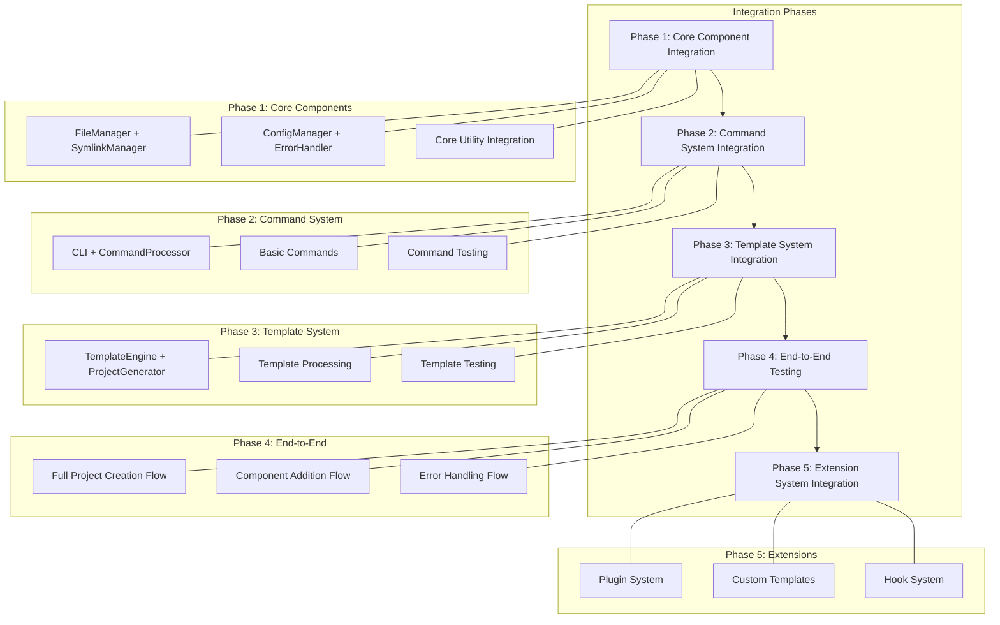
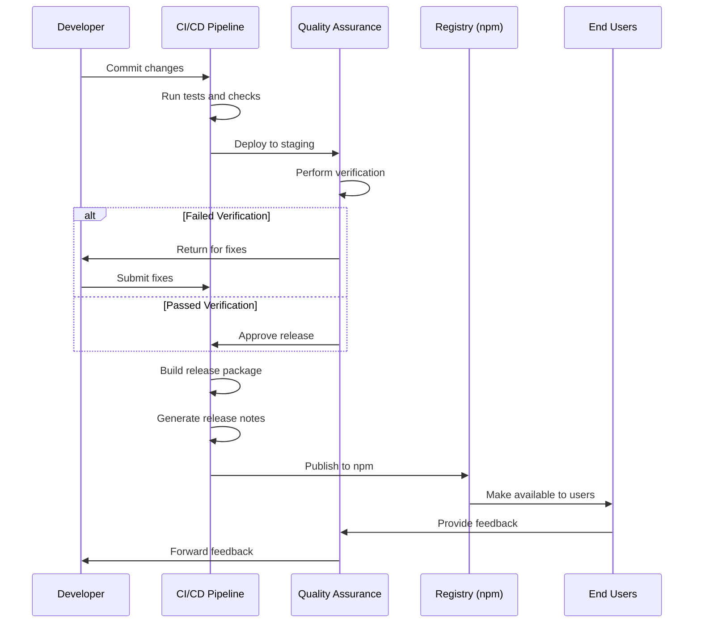

# Create-SPARC NPX Package: Completion Phase

## Overview

The Completion phase focuses on system integration, documentation, deployment strategies, monitoring, and continuous improvement plans for the create-sparc NPX package. This phase ensures the package is fully integrated, well-documented, properly deployed, and set up for ongoing maintenance and enhancement.

## System Integration

### Component Integration Strategy



### Integration Testing Strategy

1. **Component Pair Testing**
   - Test pairs of tightly coupled components
   - Verify interfaces and data flow
   - Validate error propagation

2. **Subsystem Integration**
   - Test complete subsystems (CLI, generator, etc.)
   - Validate subsystem boundaries
   - Verify subsystem contracts

3. **End-to-End Testing**
   - Test full command flows
   - Verify project creation process
   - Validate error handling and recovery

4. **Cross-Platform Testing**
   - Test on Windows, macOS, and Linux
   - Verify platform-specific behavior
   - Validate symlink handling across platforms

5. **Version Compatibility Testing**
   - Test with multiple Node.js versions
   - Verify npm/yarn/pnpm compatibility
   - Test extension compatibility

### Integration Verification Checklist

- [ ] All components can be initialized with proper dependencies
- [ ] Components communicate through defined interfaces only
- [ ] Error handling works across component boundaries
- [ ] Configuration flows properly through the system
- [ ] System performs as expected under different operating conditions
- [ ] Cross-cutting concerns are properly handled
- [ ] Extension points are properly integrated
- [ ] System can be gracefully started and stopped

## Documentation

### Documentation Structure

```
docs/
├── user/                      # User documentation
│   ├── getting-started.md     # Getting started guide
│   ├── commands.md            # Command reference
│   ├── templates.md           # Template guide
│   ├── configuration.md       # Configuration options
│   ├── examples.md            # Usage examples
│   └── troubleshooting.md     # Troubleshooting guide
│
├── developer/                 # Developer documentation
│   ├── architecture.md        # Architecture overview
│   ├── api/                   # API documentation
│   │   ├── cli.md             # CLI API
│   │   ├── project-generator.md # Project Generator API
│   │   ├── template-engine.md # Template Engine API
│   │   └── ...                # Other component APIs
│   ├── extending/             # Extension guides
│   │   ├── plugins.md         # Plugin development
│   │   ├── templates.md       # Custom templates
│   │   ├── commands.md        # Custom commands
│   │   └── hooks.md           # Hook system
│   └── contributing.md        # Contributing guide
│
├── internals/                 # Internal documentation
│   ├── design-decisions.md    # Design decision records
│   ├── testing.md             # Testing guidelines
│   ├── security.md            # Security considerations
│   └── performance.md         # Performance considerations
│
└── README.md                  # Main documentation entry point
```

### Documentation Types

1. **Reference Documentation**
   - Command-line options
   - API references
   - Configuration options
   - Template specification

2. **Guides and Tutorials**
   - Getting started guide
   - Step-by-step tutorials
   - Task-based guides
   - Best practices

3. **Conceptual Documentation**
   - Architecture overview
   - Design principles
   - Key concepts
   - System behavior

4. **Visual Documentation**
   - Diagrams and flowcharts
   - Screenshots
   - Video tutorials
   - Interactive examples

### Documentation Standards

1. **Consistency**
   - Consistent terminology
   - Standard formatting
   - Unified voice and tone
   - Consistent examples

2. **Clarity**
   - Clear, concise language
   - Appropriate level of detail
   - Logical organization
   - Progressive disclosure

3. **Completeness**
   - Comprehensive coverage
   - Error case documentation
   - Edge case handling
   - Platform-specific notes

4. **Accessibility**
   - Screen reader compatibility
   - Alternative text for images
   - Color contrast compliance
   - Keyboard navigation support

### Documentation Generation

- Use JSDoc for API documentation
- Use Markdown for general documentation
- Automate example testing
- Generate command help dynamically

## Deployment Strategy

### Release Workflow



### Version Management

1. **Semantic Versioning**
   - Major version: Breaking changes
   - Minor version: New features, non-breaking
   - Patch version: Bug fixes, non-breaking

2. **Pre-release Versions**
   - Alpha: Early testing versions
   - Beta: Feature complete, testing
   - Release Candidate: Final testing

3. **Version Compatibility**
   - Compatibility matrix
   - Deprecation policy
   - Migration guides

### CI/CD Pipeline

1. **Continuous Integration**
   - Automated testing on commit
   - Code quality checks
   - Security scanning
   - Performance benchmarking

2. **Continuous Delivery**
   - Automated staging deployments
   - Integration testing
   - Documentation generation
   - Release candidate preparation

3. **Continuous Deployment**
   - Automated npm publishing
   - Release notes generation
   - Version tagging
   - Dependency updates

### Release Checklist

- [ ] All tests pass
- [ ] Security scan is clean
- [ ] Documentation is updated
- [ ] CHANGELOG is updated
- [ ] Version is bumped according to semantic versioning
- [ ] Release notes are prepared
- [ ] Git tag is created
- [ ] npm package is published
- [ ] Announcement is prepared

## Monitoring and Support

### Usage Monitoring

1. **Download Statistics**
   - npm download counts
   - Version adoption rates
   - Geographic distribution
   - Dependency tracking

2. **Error Tracking**
   - Anonymous error reporting (opt-in)
   - Common failure patterns
   - Platform-specific issues
   - Version-specific problems

3. **Feature Usage**
   - Command popularity
   - Template usage
   - Option preferences
   - Extension adoption

### Support Channels

1. **Documentation**
   - Comprehensive guide
   - Troubleshooting section
   - FAQs
   - Examples

2. **Issue Tracking**
   - GitHub Issues
   - Bug reporting template
   - Feature request template
   - Prioritization system

3. **Community Support**
   - GitHub Discussions
   - Stack Overflow tag
   - Discord server
   - Twitter support

### Maintenance Plan

1. **Regular Maintenance**
   - Monthly dependency updates
   - Quarterly security reviews
   - Bi-annual performance optimization
   - Annual documentation refresh

2. **Bug Fix Policy**
   - Critical bugs: 24-48 hour response
   - Major bugs: 1 week response
   - Minor bugs: Next release cycle
   - Prioritization framework

3. **Backward Compatibility**
   - LTS (Long Term Support) versions
   - Deprecation policy (minimum 6-month notice)
   - Migration tools and guides
   - Breaking change justification

## Continuous Improvement

### Feedback Mechanisms

1. **User Feedback**
   - GitHub issues and discussions
   - Usage surveys
   - Direct user interviews
   - Social media monitoring

2. **Metrics Collection**
   - Performance telemetry (opt-in)
   - Error reporting
   - Feature usage statistics
   - User experience tracking

3. **Community Engagement**
   - Regular community meetings
   - RFC (Request for Comments) process
   - Beta testing program
   - Contributor recognition

### Feature Roadmap

A structured approach to planning future development:

1. **Short-term (3 months)**
   - Bug fixes and stability improvements
   - Minor feature enhancements
   - Performance optimizations
   - Documentation improvements

2. **Mid-term (6-12 months)**
   - New template types
   - Enhanced plugin system
   - Improved cross-platform support
   - Additional extension points

3. **Long-term (12+ months)**
   - GUI interface
   - Enhanced template marketplace
   - Project migration tools
   - Integration with other development tools

### Continuous Learning

1. **Codebase Analysis**
   - Regular code quality reviews
   - Architecture evaluation
   - Technical debt assessment
   - Refactoring opportunities

2. **Industry Trends**
   - Framework evolution tracking
   - Node.js ecosystem monitoring
   - Development workflow changes
   - Security practice updates

3. **Knowledge Sharing**
   - Internal documentation
   - Blog posts and articles
   - Conference presentations
   - Open source contributions

## Handoff and Training

### Internal Knowledge Transfer

1. **Documentation**
   - System architecture documentation
   - Component design documents
   - Decision records
   - Implementation notes

2. **Training Sessions**
   - Architecture walkthrough
   - Development environment setup
   - Testing procedures
   - Deployment workflows

3. **Pairing and Mentoring**
   - Pair programming sessions
   - Code reviews
   - Mentoring relationships
   - Knowledge sharing sessions

### Community Knowledge Transfer

1. **Public Documentation**
   - Getting started guides
   - Advanced usage tutorials
   - Extension development guides
   - Best practices

2. **Community Engagement**
   - Open GitHub discussions
   - Regular update posts
   - Q&A sessions
   - Live demonstrations

3. **Collaborative Development**
   - Clear contribution guidelines
   - Good first issues
   - Mentoring for contributors
   - Recognition program

## Completion Checklist

### Integration Completion

- [ ] All components are fully integrated
- [ ] All subsystems are working together
- [ ] End-to-end workflows are tested
- [ ] Cross-platform compatibility is verified
- [ ] Extension points are validated

### Documentation Completion

- [ ] User documentation is complete
- [ ] Developer documentation is complete
- [ ] API references are accurate
- [ ] Examples are tested and working
- [ ] Diagrams are current and clear

### Deployment Completion

- [ ] Release workflow is established
- [ ] CI/CD pipeline is operational
- [ ] npm package is properly configured
- [ ] Version management is set up
- [ ] Release checklists are prepared

### Monitoring Completion

- [ ] Usage tracking is implemented (opt-in)
- [ ] Error reporting is configured
- [ ] Support channels are established
- [ ] Maintenance plan is documented
- [ ] Feedback mechanisms are in place

### Continuous Improvement Setup

- [ ] Roadmap is established
- [ ] Learning mechanisms are in place
- [ ] Feedback collection is operational
- [ ] Community engagement plan is active
- [ ] Handoff documentation is complete