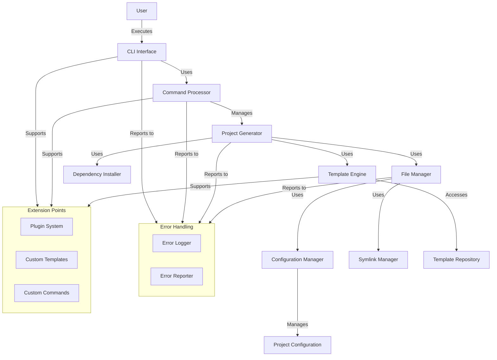

# Create-SPARC NPX Package: System Component Diagram

## System Architecture Overview

The create-sparc NPX package is designed with a modular architecture that separates concerns and allows for extensibility. The system consists of several key components that work together to provide a seamless project scaffolding experience.

## Component Diagram

## Key Components

### CLI Interface
Acts as the entry point for users, parsing commands and options, and providing feedback.

### Command Processor
Routes commands to the appropriate handlers and coordinates the execution flow.

### Project Generator
Orchestrates the project creation process, using other components to generate a complete project.

### Template Engine
Processes template files, replacing variables and applying transformations to generate project files.

### File Manager
Handles all file system operations including creating directories, files, and symlinks.

### Symlink Manager
Specializes in creating and managing symbolic links for .roo folder and .roomode files, with fallback options.

### Configuration Manager
Manages project configurations, validates user inputs, and provides defaults.

### Dependency Installer
Handles the installation of required dependencies for the generated project.

### Error Handling System
Provides centralized error management with appropriate logging, reporting, and recovery.

### Extension Points
Allows for customization and extension of the core functionality through plugins, custom templates, and commands.